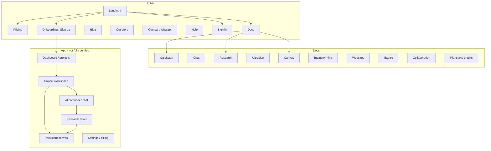

# Buildpad Reference Audit

**Audit date:** 2026-08-06  
**Reference URL:** https://buildpad.io/  
**Method:** Live browser capture (Playwright + Chrome), public page HTML extraction, official docs (`/docs/llms.txt` and individual doc pages), sitemap/robots inspection  
**Evidence root:** `docs/uiux-audit-assets/buildpad-reference/`

> **Legend:** **Verified** = observed in browser or official docs. **Inferred** = reasonable product interpretation. **Unknown** = behind auth/payment or not reachable without purchase.

---

## 1. Public-product overview

### Verified positioning

Buildpad brands itself as an **AI cofounder** that helps founders **“Make something people actually want.”** The hero promise is not “chat with AI,” but **turn an idea into a company** through guided phases, research, planning, and execution tooling.

| Signal | Evidence |
| ------ | -------- |
| Primary promise | Hero: “Make something people actually want” / “Turn your idea into a company” (`landing-hero-desktop.png`) |
| Interaction model | Landing hero uses an idea prompt (`I want to…`) + “Brainstorm ideas” shortcut + Privacy mode toggle |
| Trust | “Trusted by 100,000+ founders” with avatar row; dense testimonial carousel |
| Differentiation | Public compare page vs ChatGPT; docs emphasize AI that **leads**, persistent **canvas**, multi-agent **research**, **Ultraplan** |
| Former brand | Banner: “aicofounder.com is now Buildpad” |

### Target audience (verified + inferred)

- **Verified from copy:** Solo founders, indie hackers, early-stage builders validating and launching products.
- **Inferred:** Users who find blank-chat AI tools unstructured and want a guided product-building workflow.

### Monetization (verified public)

| Plan | Price | Credits | Support |
| ---- | ----- | ------- | ------- |
| Pro | $39/mo | 200 credits/mo, rollover | Email |
| Max | $85/mo | 500 credits/mo, rollover | Premium |

Source: `/pricing` (`pricing-desktop.png`). FAQ links cover credit exhaustion, rollover, cancellation. Help/docs cover plans & credits.

**No free forever tier advertised on pricing.** Testimonials mention free exploration; exact free-trial mechanics after account creation were **not fully verified** (auth wall / no purchase).

---

## 2. Page inventory

### Public marketing & account entry

| Screen / flow | URL | Status | Screenshot |
| ------------- | --- | ------ | ---------- |
| Landing | `/` | Verified | `landing-hero-desktop.png`, `landing-fullpage-desktop.png`, mobile/tablet variants |
| Pricing | `/pricing` | Verified | `pricing-desktop.png`, `pricing-mobile.png` |
| Sign in | `/signin` | Verified | `signin-desktop.png` |
| Onboarding / Sign up | `/onboarding` | Verified (partial) | `onboarding-first-step.png`, `onboarding-goal-selection.png`, … |
| Docs home | `/docs` | Verified | `docs-desktop.png` |
| Docs: Quickstart | `/docs/quickstart` | Verified | `docs-quickstart-desktop.png` |
| Docs: Research | `/docs/research` | Verified | `docs-research-desktop.png` |
| Docs: Canvas | `/docs/canvas` | Verified | `docs-canvas-desktop.png` |
| Docs: Ultraplan | `/docs/ultraplan` | Verified | `docs-ultraplan-desktop.png` |
| Docs: Chat / Brainstorm / Collab / Export / Credits | `/docs/*` | Verified pages exist | corresponding `docs-*.png` |
| Compare vs ChatGPT | `/compare/chatgpt` | Verified | `compare-chatgpt-desktop.png` |
| Blog | `/blog` | Verified | `blog-desktop.png` |
| Our story | `/our-story` | Verified | `our-story-desktop.png` |
| What is an AI cofounder | `/what-is-an-ai-cofounder` | Verified | `what-is-ai-cofounder-desktop.png` |
| Help center | `/help` | Verified | `help-desktop.png` |
| Help: credits | `/help/how-credits-work` | Verified | `help-credits-desktop.png` |
| Affiliate | `/affiliate` | Verified | `affiliate-desktop.png` |
| Privacy / Terms | `/privacy`, `/terms` | Verified | `privacy-desktop.png`, `terms-desktop.png` |

### App / workspace (access-limited)

| Area | Access | Notes |
| ---- | ------ | ----- |
| Authenticated dashboard / projects | Unknown / blocked without account | `/dashboard` redirects (307); not audited live |
| Project workspace, canvas, chats | Documented in docs; live UI not fully verified | Principles taken from docs + marketing demos |
| Billing inside settings | Documented; not verified in-app | — |

---

## 3. Flow inventory

| Screen or flow | URL | User goal | Structure | Key components | Interaction pattern | Strong points | Weak points | Relevant lesson |
| -------------- | --- | --------- | --------- | -------------- | ------------------- | ------------- | ----------- | --------------- |
| Landing hero | `/` | Understand product + start | Nav + serif headline + prompt + social proof | Prompt, Brainstorm CTA, Privacy toggle, floating research cards | Prompt-first conversion | Immediate mental model of AI cofounder + research | Dense motion/demo can compete with CTA | Lead with a single start action that *is* the product |
| Social proof band | `/` | Build trust | Avatar row + founder quotes | Testimonial carousel | Passive scroll | High volume of named founders | Hard to verify authenticity quickly | Quantity of proof matters for founder tools |
| Feature narrative | `/` | Learn phases/research/canvas | Sectioned storytelling | Phase demos, agent status UI, sticky notes | Scroll storytelling | Shows process, not just features | Long page; cognitive load | Show the *system* (phases, agents, artifacts) |
| Pricing | `/pricing` | Decide to pay | 2-tier cards + FAQ | Most popular badge, credit bullets | Compare → Start now | Clear, simple, no dark patterns visible | No free tier on page; credit meaning abstract until docs | Transparent pricing reduces distrust |
| Sign in | `/signin` | Return | Minimal form + Google | Google + email, testimonial sidebar | OAuth-first | Low friction return path | — | Keep auth calm; reinforce trust beside form |
| Onboarding setup | `/onboarding` | Personalize | Multi-step cards | Goal, experience, solo/team, 6-month goal | Multiple-choice progressive | Almost no typing; strong progressive disclosure | Many steps before product value | Ask goals via choices, not essays |
| Docs quickstart | `/docs/quickstart` | Learn workspace | Linear guide | Project prompt, canvas, Ultraplan | Read + links | Clear first-session mental model | Docs ≠ product UI proof | Document the intended journey even if UI evolves |
| Research docs | `/docs/research` | Understand research trust | 3-stage agent model | Approve/Skip credit gate, citations | Propose → approve → watch agents → canvas doc | Human control over expensive AI | Credits can create anxiety | Always require approval for costly research |
| Compare ChatGPT | `/compare/chatgpt` | Justify switch | Dichotomies + table | Guided vs blank chat, canvas vs memory | Objection handling | Sharp category creation | Aggressive framing | Own a crisp “we are not ChatGPT” wedge |

---

## 4. Buildpad sitemap

---

## 5. Detailed UX observations

### 5.1 Landing & conversion (Verified)

- **Prompt-as-CTA:** The primary conversion control is an idea input, not only a “Sign up” button. Secondary path: “Brainstorm ideas.”
- **Product demo in-hero:** Floating “Market research report,” source counts, “You”/“AI” cursors, phase path icons communicate multi-agent research before scroll.
- **Nav is sparse but strategic:** Pricing · Docs · Our story + Sign in / Sign up.
- **Privacy mode toggle** in hero signals trust for sensitive ideas (Verified UI; behavior details in docs).

### 5.2 Onboarding (Verified partial)

Observed steps before account completion:

1. Welcome (“Ready to set up Buildpad?”) with research-preview illustration → **Let’s go!**
2. Immediate goal (6 choice cards): find idea / validate / figure out where to start / build & launch / find customers / fix or pivot
3. Prior business experience (first time → serial)
4. Solo vs partner vs small team
5. Social-proof interstitial (“You’re in trusted hands”)
6. 6-month achievement goal (launch / revenue / PMF / full-time / investment)

**Pattern:** Multiple-choice, low typing, personalization framed as calibration. Auth/payment completion and post-auth workspace were **not fully completed** in this audit (no purchase; account creation not finished).

### 5.3 Core product system (Docs-verified; live app partially unknown)

From Quickstart / Chat / Research / Ultraplan / Canvas docs:

1. Dashboard prompt creates a project  
2. AI leads with one question at a time  
3. Canvas captures durable artifacts  
4. Ultraplan identifies the single biggest blocker  
5. Research is proposed, user **Approves/Skips** (credit-aware)  
6. Findings land on canvas; AI suggests next step  
7. Optional website builder, content calendar, export, collaboration

### 5.4 AI interaction design (Docs + marketing verified)

| Pattern | Observation |
| ------- | ----------- |
| AI leads | Explicitly positioned vs blank-chat tools |
| Suggested starts | “Start project” / “Brainstorm ideas” |
| Research approval | Credit-gated Approve/Skip card |
| Process transparency | Agent statuses, source counts in demos |
| Citations | Inline citations; dedicated citations agent (docs) |
| Persistence | Canvas docs/notes/websites across chats |
| Challenge tone | “Honest, not sycophantic” messaging |
| Attachments | Images + PDFs in chat (docs) |

### 5.5 Design-system observations (Estimated from screenshots — do not copy)

| Token area | Pattern estimate |
| ---------- | ---------------- |
| Background | Warm off-white / cream with subtle grid |
| Type | Serif display for brand headlines; sans for UI |
| Accent | Near-black primary CTAs; pastel functional accents (yellow research, multi-color logo) |
| Radius | Soft, large cards; circular icon nodes |
| Density | High whitespace marketing; product demos show denser agent lists |
| Motion | Animated agent/research demos on landing |
| Components | Prompt bar, choice cards, pricing cards, sticky-note metaphors, progress dots on agents |

### 5.6 Responsive (Verified)

- Mobile landing and pricing captured (`landing-hero-mobile.png`, `pricing-mobile.png`, `onboarding-mobile.png`).
- Marketing remains single-column friendly; header compresses.
- Long AI/report content in authenticated app on mobile: **Unknown**.

### 5.7 Accessibility (Partial)

- Public pages use clear headings and large CTAs (Verified visually).
- Keyboard-only full audit, focus rings, and screen-reader semantics: **not exhaustively tested**.
- Choice-card onboarding is mouse-friendly; keyboard operability **Unknown**.

---

## 6. Strengths

1. **Category clarity:** “AI cofounder / guided product building,” not generic chatbot.  
2. **Prompt-first landing** collapses understanding + activation.  
3. **Progressive, low-typing onboarding** personalizes without friction.  
4. **Research trust system:** approve gate, multi-agent visibility, citations.  
5. **Persistent workspace metaphor (canvas)** for retention and context.  
6. **Transparent paid pricing** with credit education in help/docs.  
7. **Strong social proof volume** and compare-page objection handling.

## 7. Weaknesses / risks (as a reference)

1. **Long marketing page** may delay comprehension for impatient users.  
2. **Credits abstraction** can confuse until docs are read.  
3. **Many onboarding questions** delay time-to-product (abandonment risk).  
4. **Broad scope** (research + websites + calendar + collab) may dilute focus vs a specialist research tool.  
5. **Authenticity of “100,000+ founders”** is a marketing claim; not independently verified here.

---

## 8. Reusable principles (adapt, do not clone)

1. **Start with the job, not the feature list** — one sentence + one start action.  
2. **Make the first interaction the product** (prompt / brainstorm).  
3. **AI should propose next steps**, not only answer.  
4. **Expensive AI actions need human approval** and visible cost.  
5. **Show work-in-progress** (agents, stages, sources) to build trust.  
6. **Persist artifacts outside chat** so progress feels real.  
7. **Personalize with choices**, not long forms.  
8. **Publish a crisp competitor wedge** (what you are / are not).  
9. **Keep pricing understandable** on a dedicated page.  
10. **Use phases/milestones** to create momentum without gamification spam.

---

## 9. Screenshots and references

All under `docs/uiux-audit-assets/buildpad-reference/`. Key files:

- `landing-hero-desktop.png`, `landing-hero-mobile.png`, `landing-hero-tablet.png`
- `landing-social-proof-desktop.png`, `landing-phases-desktop.png`, `landing-research-desktop.png`, `landing-footer-desktop.png`
- `phase-progress-pattern.png`, `research-source-presentation.png`, `workspace-canvas-marketing.png`
- `pricing-desktop.png`, `pricing-mobile.png`
- `signin-desktop.png`, `onboarding-first-step.png`, `onboarding-goal-selection.png`, `onboarding-social-proof-step.png`
- `docs-*.png`, `compare-chatgpt-desktop.png`, `blog-desktop.png`

## 10. Access limitations

| Limitation | Impact |
| ---------- | ------ |
| No paid plan purchased | No full credit/billing UX inside app |
| Account creation not completed | Post-auth dashboard, canvas, live research, export, collab not directly verified |
| Browser MCP unavailable | Used Playwright/Chrome headless instead |
| A11y not fully instrumented | Only visual/structural notes |
| Marketing claims (user counts) | Not independently verified |

**Inference vs fact:** Product-system details for workspace behavior rely heavily on **official documentation** plus marketing demos; treat live in-app nuances as **Unknown** until authenticated testing is approved.
