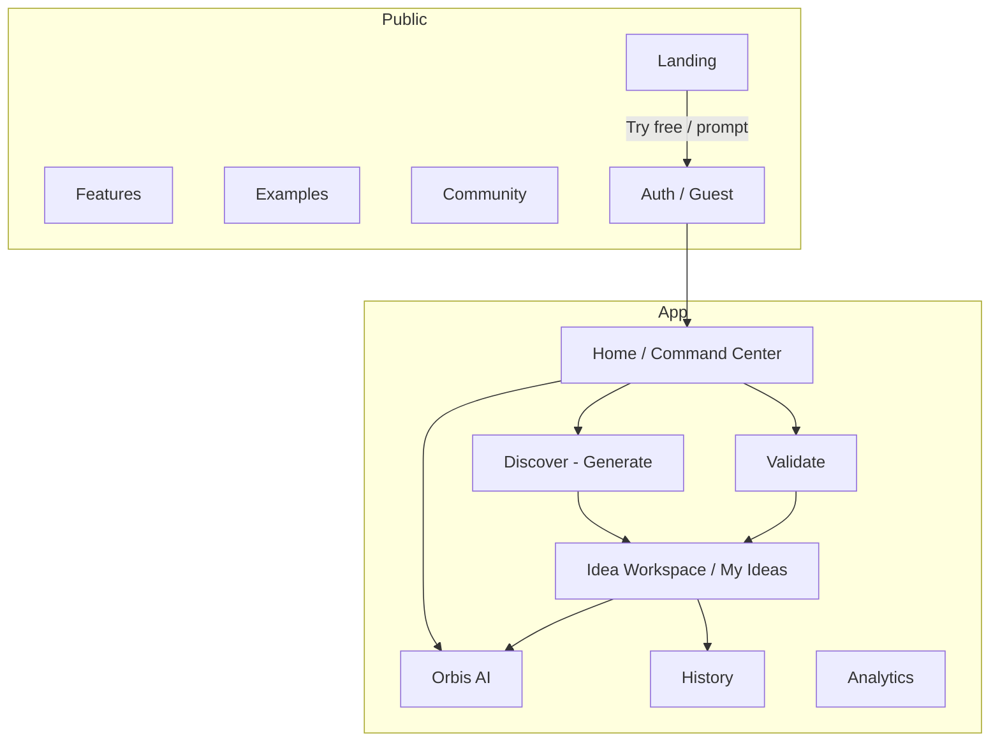
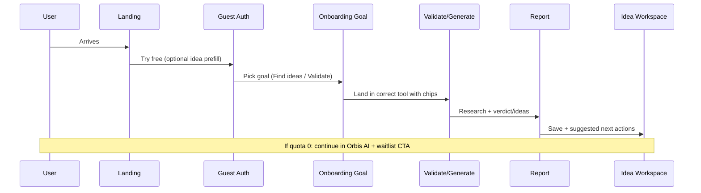

# Orbis UI/UX Implementation Plan

**Date:** 2026-08-06  
**Status:** Planning only — no production code changes in this phase  
**Inputs:** Buildpad reference audit, Orbis audit, gap analysis  
**Screenshot evidence:** `docs/uiux-audit-assets/`

---

## 1. Recommended target experience

Orbis remains a **Founder Research OS**: the fastest path from uncertainty → evidence → Build/Pivot/Skip decision.

### Target principles (adapted from Buildpad, not copied)

1. **Value in the first session** — guest user completes one useful report quickly.  
2. **AI proposes the next step** after every major output.  
3. **Usage is never a surprise** — reports remaining always visible.  
4. **Artifacts outlive chat** — every report attaches to an Idea.  
5. **Honest monetization** — waitlist or billing, never fake checkout.  
6. **Specialist focus** — no website builder / canvas clone.

### Target information architecture

### Target user journey

---

## 2. Phased roadmap

| Phase | Focus | Outcomes |
| ----- | ----- | -------- |
| **Phase A — Activation** | Onboarding, usage meter, empty states, dashboard resume | First report completion ↑ |
| **Phase B — Trust & conversion** | Landing prompt, post-quota path, analytics events, a11y | Waitlist/signup ↑, fewer dead ends |
| **Phase C — Artifact system** | Idea workspace links, export/share, next-step engine | Retention ↑ |
| **Phase D — Strategic** | Billing decision, deeper research theater, IA regroup | Revenue or clarified free model |

---

## 3. Workstreams

### WS1 — Product positioning and landing page

| Field | Content |
| ----- | ------- |
| Objective | Make activation as clear as understanding; optional prompt → guest validate |
| Current problem | CTA is strong but not product-like; sample report hardcoded |
| Proposed solution | Keep Orbis wedge; add optional idea textarea that deep-links to `/auth?mode=guest&next=/validate&prefill=` |
| Buildpad principle | Prompt-as-CTA |
| Adapt how | Orbis validates/generates; do not copy Buildpad hero art/copy |
| User stories | As a visitor, I can paste an idea and start validation as guest |
| Screens | `Landing` |
| Files | `src/pages/Landing.tsx`, `src/pages/Auth.tsx`, `src/pages/ValidateIdea.tsx` |
| API/DB | None |
| Analytics | `landing_prompt_submit`, `landing_cta_click` |
| A11y | Labelled textarea; keyboard submit |
| Responsive | Stack prompt on mobile |
| Size | **M** |
| Acceptance | Prefill appears in Validate composer; guest session created |

### WS2 — Global navigation and IA

| Field | Content |
| ----- | ------- |
| Objective | Express journey order without removing tools |
| Problem | Flat sidebar of peer tools |
| Solution | Group labels: Research (Generate, Validate), Advise (Orbis AI), Library (Ideas, History, Analytics) |
| Principle | Progressive disclosure / phase awareness |
| Files | `src/components/AppSidebar.tsx` |
| Size | **S** |

### WS3 — Authentication and onboarding

| Field | Content |
| ----- | ------- |
| Objective | Replace informational tour with goal routing + first-value |
| Problem | `OnboardingTour` does not navigate (`OnboardingTour.tsx`) |
| Solution | Choice cards: “Find ideas” / “Validate an idea” / “Talk to advisor” → navigate + set `orbis_onboarding_complete` after first successful action or explicit skip |
| Principle | Low-typing calibration |
| Files | `OnboardingTour.tsx`, `Dashboard.tsx`, maybe `lib/storage.ts` |
| Size | **M** |

### WS4 — Dashboard and project organization

| Field | Content |
| ----- | ------- |
| Objective | Command center for resume + next action |
| Problem | Stats-only empty dashboard |
| Solution | Recent reports list, reports remaining chip, primary recommended CTA, wire `GuestUpgradeBanner` |
| Files | `Dashboard.tsx`, `GuestUpgradeBanner.tsx`, `lib/db.ts` |
| Size | **M** |

### WS5 — Core guided workflow

| Field | Content |
| ----- | ------- |
| Objective | After each report, propose exactly one next step |
| Problem | User dropped at results without coaching |
| Solution | NextStepCard: Save idea / Validate top idea / Ask Orbis AI / Export |
| Files | `GenerateIdeas.tsx`, `ValidateIdea.tsx`, new `components/NextStepCard.tsx` |
| Size | **M** |

### WS6 — AI interaction experience

| Field | Content |
| ----- | ------- |
| Objective | Consistent starters + post-report prompts |
| Problem | Chat has chips; Generate/Validate don’t |
| Solution | Shared `StarterChips` component; fix stale credit copy in `orbis-chat` prompt |
| Files | `OrbisChat.tsx`, `GenerateIdeas.tsx`, `ValidateIdea.tsx`, `supabase/functions/orbis-chat/index.ts` |
| Size | **S–M** |

### WS7 — Research and source presentation

| Field | Content |
| ----- | ------- |
| Objective | Make deep research trust obvious |
| Problem | Process less visible than Buildpad agent theater |
| Solution | Polish `ResearchTrace` + stage labels; surface citation count early |
| Files | `ResearchTrace.tsx`, generate/validate pages |
| Size | **S** |

### WS8 — Progress and task system

| Field | Content |
| ----- | ------- |
| Objective | Make backlog statuses meaningful |
| Problem | Statuses underutilized |
| Solution | Auto-suggest status transitions after validate; checklist on idea detail |
| Files | `Backlog.tsx`, `lib/db.ts` |
| Size | **M** |

### WS9 — Generated outputs and artifact management

| Field | Content |
| ----- | ------- |
| Objective | Export/share reports; link to ideas |
| Problem | AI handoff only |
| Solution | Markdown download v1; optional share token later |
| Files | new `lib/exportReport.ts`, scorecard/report views |
| API/DB | Share tokens need table — phase 2 |
| Size | **M** (MD), **L** (share links) |

### WS10 — Design-system cleanup

| Field | Content |
| ----- | ------- |
| Objective | Consistent empty/loading/error components |
| Solution | `PageSkeleton`, `EmptyState`, `ErrorState` primitives |
| Files | `components/ui/*`, pages |
| Size | **M** |

### WS11 — Responsive

| Field | Content |
| ----- | ------- |
| Objective | Long reports usable at 390px |
| Solution | Stack intelligence grids; sticky composer safe-areas |
| Size | **S–M** |

### WS12 — Accessibility

| Field | Content |
| ----- | ------- |
| Objective | Keyboard + labels + focus restore for tour/modals |
| Size | **S–M** |

### WS13 — Loading / empty / success / error

Covered with WS10 + meter (WS usage) + retry buttons on research failures.

### WS14 — Analytics and measurement

| Field | Content |
| ----- | ------- |
| Objective | Instrument funnel without assuming PostHog |
| Solution | Thin `lib/analytics.ts` wrapping `console`/pluggable sink; document events |
| Size | **S** |

### WS15 — Performance and technical cleanup

| Field | Content |
| ----- | ------- |
| Objective | Remove dead code; align docs; decide React Query usage |
| Files | `Index.tsx`, `GuestUpgradeBanner` wiring, README drifts |
| Size | **S** |

---

## 4. Implementation tickets (dependency order)

## Ticket `ORB-UX-001`: Reports-remaining meter in app chrome

**Priority:** P0  
**Workstream:** WS4 / WS13  
**Estimated size:** S  
**Dependencies:** None  

### Problem
Users discover quota only when research fails (`hasCredits` → `UpgradeModal`).

### Proposed change
Show “N free reports left” in `AppSidebar` footer and/or `AppLayout` header; update via `useCredits`.

### Reference insight
Buildpad surfaces credit cost before research approval — adapt as always-visible remaining count (Orbis uses report credits, not Buildpad’s credit economy).

### Repository areas
`AppSidebar.tsx`, `AppLayout.tsx`, `useCredits.ts`, `ProfileSheet.tsx`

### Implementation steps
1. Extend `useCredits` consumers in chrome.  
2. Render meter for guests + registered free users.  
3. Clicking meter opens upgrade/waitlist modal.  

### Acceptance criteria
- Meter visible on Generate/Validate before run.  
- Shows 0 when exhausted.  
- Accessible text (not color-only).  

### Required states
Default, loading (skeleton/pulse), zero, unlimited/waitlisted copy, mobile, keyboard focus.

### Tests
Component test for meter rendering; e2e guest sees meter on `/generate`.

### Risks
Copy for waitlist vs unlimited must stay honest.

---

## Ticket `ORB-UX-002`: Goal-based onboarding routing

**Priority:** P0  
**Workstream:** WS3  
**Estimated size:** M  
**Dependencies:** None (pairs with 001)  
**Status:** Implemented — see `docs/implementation/orb-ux-002-goal-onboarding.md`

### Problem
`OnboardingTour` steps include `route` but never navigate — informational only.

### Proposed change
Replace/extend tour step 1 with goal choices that `navigate()` to `/generate`, `/validate`, or `/chat`. Keep skip. Mark complete on skip or after landing tool interacted / explicit “Get started”.

### Reference insight
Buildpad calibrates with multiple-choice goals before work — Orbis should ask **one** goal and immediately deliver tool value.

### Repository areas
`src/components/OnboardingTour.tsx`, `Dashboard.tsx`

### Acceptance criteria
- Choosing “Validate” lands on `/validate` with focus in composer.  
- Skip still sets onboarding complete (now user-scoped `orbis_onboarding_complete:<user-id>`, with legacy global key compatibility).  
- Does not block keyboard users.  

### Required states
Default, each goal, skip, mobile sheet, focus restore.

### Tests
Component tests for navigation; e2e guest onboarding path.

---

## Ticket `ORB-UX-003`: Post-quota continuation experience

**Priority:** P0  
**Workstream:** WS1/WS4  
**Estimated size:** S  
**Dependencies:** 001 / 001A  
**Status:** Implemented — see [`docs/implementation/orb-ux-003-post-quota-continuation.md`](./implementation/orb-ux-003-post-quota-continuation.md)

### Problem
Quota exhaustion opens waitlist modal with no guided free continuation.

### Proposed change
When credits = 0, modal offers: (1) Join waitlist, (2) Continue with Orbis AI (free), (3) Review saved ideas/history. Dashboard shows a compact continuation panel (not `GuestUpgradeBanner`, which is guest→account conversion).

### Reference insight
Avoid dead ends; keep user in product momentum even when paid research is gated.

### Repository areas
`UpgradeModal.tsx`, `PostQuotaContinuationPanel.tsx`, `Dashboard.tsx`, Generate/Validate pages, AppSidebar meter

### Acceptance criteria
- Exhausted user can reach `/chat` in one click from paywall.  
- Waitlist still available.  
- Copy does not claim live unlimited billing.

---

## Ticket `ORB-UX-004`: Shared empty-state starter chips

**Priority:** P1  
**Workstream:** WS6 / WS10  
**Estimated size:** S  
**Dependencies:** None  
**Status:** Implemented — see [`docs/implementation/orb-ux-004-shared-starter-chips.md`](./implementation/orb-ux-004-shared-starter-chips.md)

### Problem
Chat has starters; Generate/Validate empty states are sparse.

### Proposed change
`StarterChips` with tool-specific examples; Generate/Validate fill + focus (no auto-send); Chat preserves send-once.

### Repository areas
New `components/StarterChips.tsx`; `GenerateIdeas.tsx`, `ValidateIdea.tsx`, `OrbisChat.tsx`

### Acceptance criteria
Each tool shows ≥3 starters on empty state; keyboard activatable.

---

## Ticket `ORB-UX-005`: Dashboard resume & recommended next

**Priority:** P1  
**Workstream:** WS4  
**Estimated size:** M  
**Dependencies:** 001  

### Problem
Dashboard shows zeros without resume.

### Proposed change
Fetch last 3 generator runs + validation reports; show cards; if empty, emphasize onboarding CTA; if reports exist, “Continue” / “Validate this idea”.

### Repository areas
`Dashboard.tsx`, `lib/db.ts`

### Acceptance criteria
Returning user sees last report title + timestamp within 1 click of open.

---

## Ticket `ORB-UX-006`: Landing idea prompt → guest validate

**Priority:** P1  
**Workstream:** WS1  
**Estimated size:** M  
**Dependencies:** 002 helpful but not required  

### Problem
Landing CTA doesn’t capture the idea while intent is hottest.

### Proposed change
Optional prompt on landing; store prefill in `sessionStorage`; guest auth → `/validate` with prefilled message.

### Repository areas
`Landing.tsx`, `Auth.tsx`, `ValidateIdea.tsx`

### Acceptance criteria
End-to-end: typed idea appears in Validate composer after guest entry.

---

## Ticket `ORB-UX-007`: NextStepCard after research results

**Priority:** P1  
**Workstream:** WS5  
**Estimated size:** M  
**Dependencies:** 004  

### Problem
Results pages lack a single obvious next action.

### Proposed change
Sticky/inline card with one primary + two secondary actions based on context (e.g., after Generate → Validate top idea).

### Repository areas
New `NextStepCard.tsx`; generate/validate result views

### Acceptance criteria
Primary CTA visible without scrolling on desktop results; tracked via analytics.

---

## Ticket `ORB-UX-008`: Analytics event plumbing

**Priority:** P1  
**Workstream:** WS14  
**Estimated size:** S  
**Dependencies:** None  

### Problem
No product analytics SDK — cannot measure funnel.

### Proposed change
Add `src/lib/analytics.ts` with `track(event, props)` no-op/pluggable; instrument key events (see §5). Do **not** add a vendor without product decision.

### Acceptance criteria
Events fire in dev console; documented table in this file; no PII beyond coarse booleans.

---

## Ticket `ORB-UX-009`: Accessibility pass (tour, icon buttons, focus)

**Priority:** P1  
**Workstream:** WS12  
**Estimated size:** S  
**Dependencies:** 002  

### Problem
Tour close button and various icon controls lack labels; focus not managed.

### Proposed change
aria-labels; focus trap for onboarding; restore focus on dismiss.

### Acceptance criteria
Keyboard-only complete onboarding + open Generate; axe clean on touched components.

---

## Ticket `ORB-UX-010`: Markdown export for validation reports

**Priority:** P1  
**Workstream:** WS9  
**Estimated size:** M  
**Dependencies:** None  

### Problem
Only AI handoff export exists.

### Proposed change
Client-side Markdown download of verdict, scores, evidence links, intelligence summary.

### Acceptance criteria
Download works offline from rendered report; filename includes idea slug/date.

---

## Ticket `ORB-UX-011`: Sidebar journey grouping

**Priority:** P2  
**Workstream:** WS2  
**Estimated size:** S  
**Dependencies:** None  

### Problem
Flat nav.

### Proposed change
Section labels in `AppSidebar` without removing routes.

---

## Ticket `ORB-UX-012`: Idea ↔ report linking (Idea Workspace v1)

**Priority:** P2  
**Workstream:** WS6/WS8/WS9  
**Estimated size:** L  
**Dependencies:** Product decision on schema  

### Problem
Artifacts fragmented.

### Proposed change
When saving idea from report, store `source_report_id` / `source_run_id` if not present; Ideas detail shows linked reports.

### API/DB
Likely columns on `backlog_items` — confirm against migrations/types.

### Risks
Requires schema migration on remote Supabase.

---

## Ticket `ORB-UX-013`: Billing vs waitlist product decision spike

**Priority:** P1 (decision)  
**Workstream:** WS1  
**Estimated size:** S (doc) / XL (if Stripe)  
**Dependencies:** Business  

### Problem
$19 unlimited waitlist creates conversion ambiguity vs Buildpad’s live pricing.

### Proposed change
Decision record: (A) ship Stripe, (B) keep waitlist but remove “Go Pro” immediacy language, (C) expand free tier with soft caps.

### Acceptance criteria
Written decision in `docs/` before UX copy changes for pricing.

---

## Ticket `ORB-UX-014`: Dead code & copy drift cleanup

**Priority:** P2  
**Workstream:** WS15  
**Estimated size:** S  
**Dependencies:** None  

### Problem
Unused `Index.tsx`, unused banner historically, README Framer Motion, potential “5 free credits” in orbis-chat.

### Proposed change
Delete/wire unused UI; fix prompts/docs.

---

## Ticket `ORB-UX-015`: Unified PageSkeleton / EmptyState / ErrorState

**Priority:** P2  
**Workstream:** WS10  
**Estimated size:** M  
**Dependencies:** 004  

### Problem
Inconsistent loading/empty/error.

### Proposed change
Shared primitives; migrate Analytics/Community/Dashboard.

---

## 5. Measurement plan

Do not assume PostHog/GA. Start with pluggable `track()`.

| Event name | Trigger | Properties | Business question |
| ---------- | ------- | ---------- | ----------------- |
| `landing_cta_click` | Try Free click | `placement` | Which CTA converts? |
| `landing_prompt_submit` | Hero prompt submit | `has_text` | Does prompt activation help? |
| `auth_guest_start` | Guest session created | `from` | Guest funnel volume |
| `onboarding_goal_select` | Goal chosen | `goal` | Which goals dominate? |
| `onboarding_skip` | Skip tour | — | Tour friction |
| `research_started` | Generate/Validate run | `type`, `mode`, `credits_left` | Activation |
| `research_succeeded` | Report rendered | `type`, `mode`, `duration_ms` | Time-to-value |
| `research_failed` | Error toast path | `type`, `code` | Reliability |
| `quota_hit` | credits=0 gate | `surface` | Paywall pressure |
| `waitlist_join` | Waitlist success | `source` | Conversion intent |
| `post_quota_chat_click` | Continue with AI | — | Dead-end salvage |
| `idea_saved` | Backlog save | `from` | Artifact retention |
| `next_step_click` | NextStepCard | `action` | Guidance effectiveness |
| `export_markdown` | Export | `type` | Sharing demand |
| `report_opened_from_dashboard` | Resume click | — | Retention |

**Success metrics for Phase A:**  
↑ `% guests who complete ≥1 research_succeeded` · ↓ `onboarding_skip` before first tool · ↓ bounce after `quota_hit` (via `post_quota_chat_click` or history).

---

## 6. Testing strategy

| Layer | Scope |
| ----- | ----- |
| Unit | `useCredits` meter logic, analytics wrapper, export markdown |
| Component | Onboarding goals, StarterChips, NextStepCard, UpgradeModal variants |
| Integration | Prefill landing → auth → validate |
| E2E (Playwright later) | Guest happy path; quota gate; mobile nav |
| Visual | Screenshots under `docs/uiux-audit-assets/` regenerated per phase |
| A11y | Keyboard paths + lint/axe on changed components |

---

## 7. Dependencies & risks

| Risk | Mitigation |
| ---- | ---------- |
| Waitlist vs billing ambiguity | ORB-UX-013 decision before pricing copy overhaul |
| Remote edge prompt edits need deploy | Separate backend ticket; frontend copy first |
| Schema for idea linking | Investigate types before ORB-UX-012 |
| Over-scoping canvas | Explicitly out of roadmap |
| Analytics vendor choice | Pluggable sink |

---

## 8. Suggested first implementation ticket

**Start with `ORB-UX-001` (reports-remaining meter)** — smallest P0, unblocks honest UX for ORB-UX-003, and is independently shippable.

Then immediately **`ORB-UX-002`** (goal onboarding) for activation impact.
